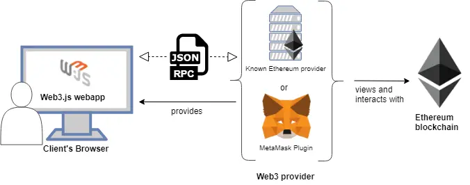

# 錢包連接

## 動機
只要與以太坊網路請求資料或寫入資料，就一定要與它搭起之間的橋樑，於是必須做出一個按鈕，可以登入自己的區塊練錢包，利用錢包取得使用此系統的操作權限，並且保持登入狀態，以利之後可能的交易簽屬。

 

 

## 概念
如果了解Web3 Provider的概念一定會知道([什麼是Web3 Provider ?]())，這個提供者其實就是所謂的橋樑，因為區塊練網路為完全不同的結構概念，無法利用傳統的HTTP協定做之間的溝通，所以必須利用特殊的傳輸協定稱作 " JSON-RPC "，它是以JSON的形式去把Javescript代碼轉換成Json代碼，利用此代碼發出請求(Request)，再透過區塊練網絡專用的RPC伺服器與區塊練溝通。

不過其實在Web3 Provider還未問世前，與智能合約溝通唯一方式，是只能通過以太坊節點(json-rpc服務器)所提供的json-rpc API。而使用json-rpc不是非常容易，所以web3函式庫就提供了一系列的抽象API呼叫，只要透過這個函式庫，就能與任何以太坊結點進行交互。

然而我們只是要開發簡單的功能，所以無須自己架設我們自己的以太坊結點伺服器，我們只需透過第三方提供的免費方案，就能藉由第三方架設好的伺服器與區塊練做溝通。

 

 

## 架構

* 運作原理
    
    
    > 圖片取自[https://github.com/ethereumbook/ethereumbook/issues/376](https://github.com/ethereumbook/ethereumbook/issues/376)

* 邏輯圖

    

 

 

## 設計方法
我們因為只是要連線到我們的錢包，並且把錢包資訊運作在前端網頁上，所以唯一要做的事，就是透過函式庫產生的provider，連接到區塊練錢包，並把錢包資料儲存在網頁中。

我們選擇的函式庫為Ethers Js，它是參考了Web3 Js的設計並進行了優化改良，再開發出更為輕量直觀的函式庫。

不過事實上，因為我們沒有額外的特殊需求，所以我們選用MetaMask作為我們的錢包入口，MetaMask在瀏覽器中為第三方外掛插件，它的運作底層就已經利用Web3 Js函式庫為我們產生provider並連結至infura第三方以太坊結點了，所以在這裡我們只需要直接利用Ethers Js去連結MetaMask錢包就好了。

 

 

## 組件說明

 

 

## 存在問題

 

 